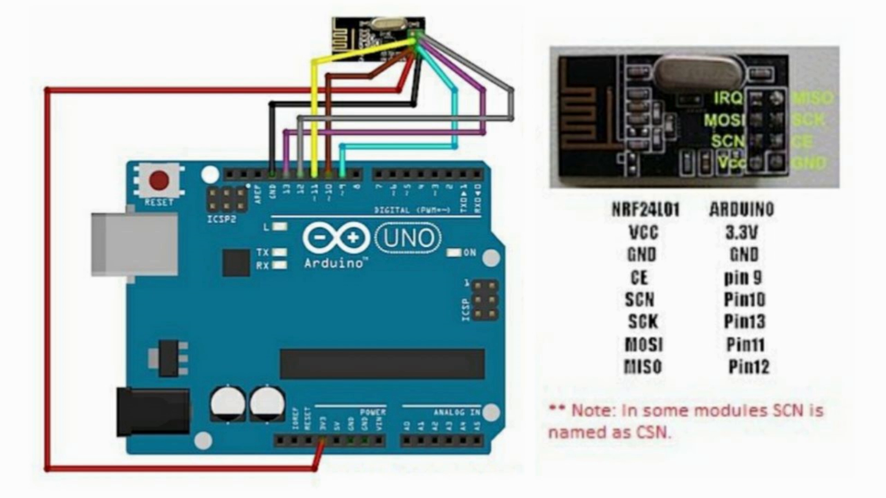
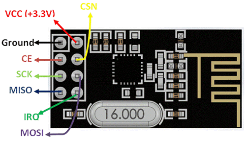

# NRF24L01 with Arduino: Wiring and Setup Guide

This repository provides a comprehensive guide and code examples for interfacing the NRF24L01 wireless communication module with Arduino.

GitHub Repository: [NRF24-BlueJammer](https://github.com/jbalagiya/NRF24-BlueJammer)

## Overview

The NRF24L01 is a wireless transceiver module that operates in the 2.4GHz band. It can be easily integrated with an Arduino to create wireless communication systems for IoT, robotics, and remote control projects.

## Wiring Diagram

Below are the wiring details for connecting the NRF24L01 module to an Arduino UNO:

| **NRF24L01 Pin** | **Arduino UNO Pin** |
|------------------|--------------------|
| VCC              | 3.3V              |
| GND              | GND               |
| CE               | Pin 9             |
| CSN (or SCN)     | Pin 10            |
| SCK              | Pin 13            |
| MOSI             | Pin 11            |
| MISO             | Pin 12            |

**Note:** Ensure that the NRF24L01 is powered by the 3.3V pin, as connecting it to 5V may damage the module.

### Wiring Visuals

#### Image 1: Wiring Diagram with Arduino UNO

#### Image 2: NRF24L01 Pin Layout

## Getting Started

### Hardware Requirements

- Arduino UNO (or compatible board)
- NRF24L01 module
- Breadboard and jumper wires
- Capacitor (10 µF) to stabilize power (optional but recommended)

### Software Requirements

- Arduino IDE
- RF24 Library ([Download here](https://github.com/tmrh20/RF24))

### Installation

1. Connect the NRF24L01 module to the Arduino following the wiring diagram.
2. Install the RF24 library in your Arduino IDE:
   -  Go to **Sketch > Include Library > Manage Libraries...**
   -  Search for "RF24" and install the library by TMRh20.

### Example Code

Here is a basic example to initialize communication:

### Troubleshooting
- Issue: NRF24L01 module doesn't respond.
-Solution: Add a capacitor (10 µF) between the VCC and GND pins to stabilize the power supply.

- Issue: Poor communication range.
- Solution: Ensure antennas are aligned and not obstructed.

### Contributions
- Feel free to fork this repository and create pull requests for improvements or additional examples.

### Disclaimer
This project is for educational purposes only. How you use this information is your own responsibility. I will not be held accountable for any illegal activities.
